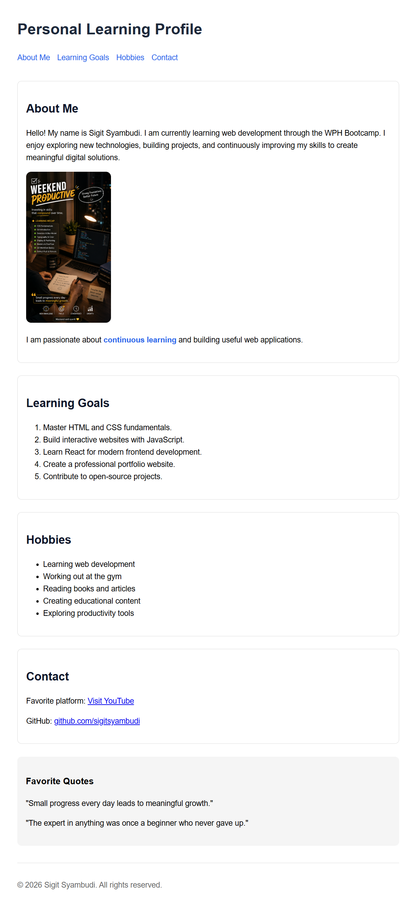

# Personal Learning Profile

A mini project built to practice HTML, CSS, and Git fundamentals through the WPH Bootcamp.

## Preview

  

## Features

- Semantic HTML structure
- External CSS styling
- Responsive content layout
- Navigation links
- Ordered and unordered lists
- External links with security best practices
- Image accessibility using alt attributes

## Technologies

- HTML5
- CSS3
- Git
- GitHub

## Author

**Sigit Syambudi**

- GitHub: [@sigitsyambudi](https://github.com/sigitsyambudi)

## Live Demo

🌐 https://sigitsyambudi.github.io/wph-week1-personal-learning-profile/
